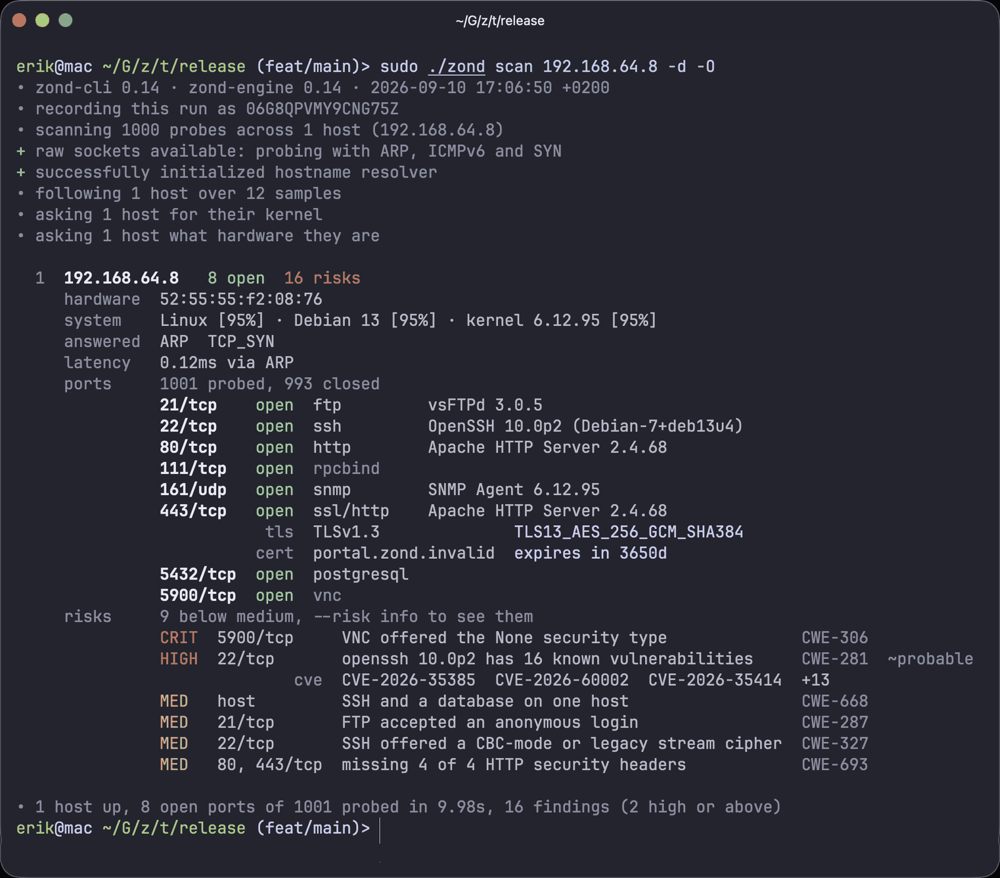
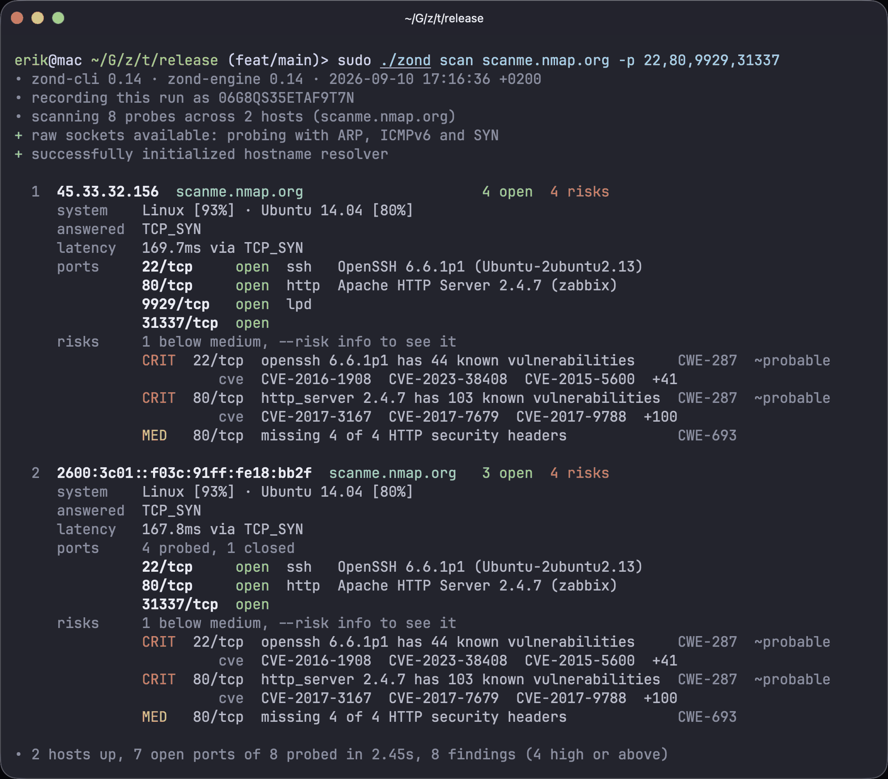
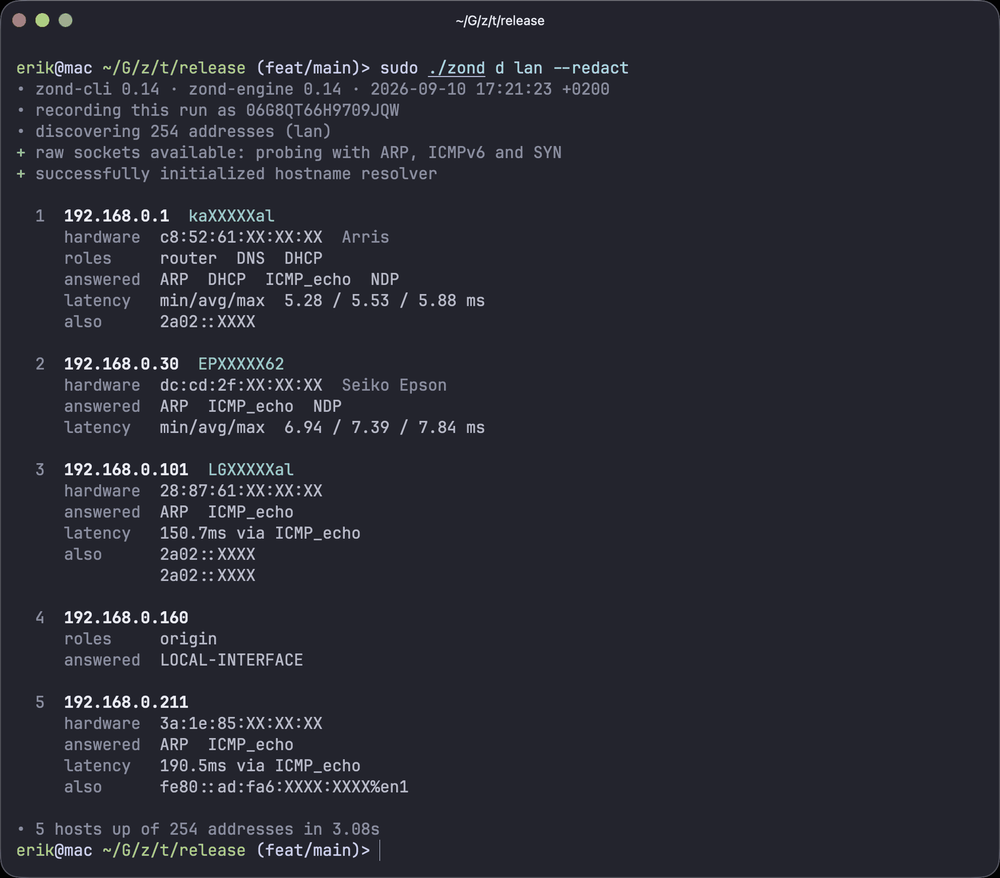
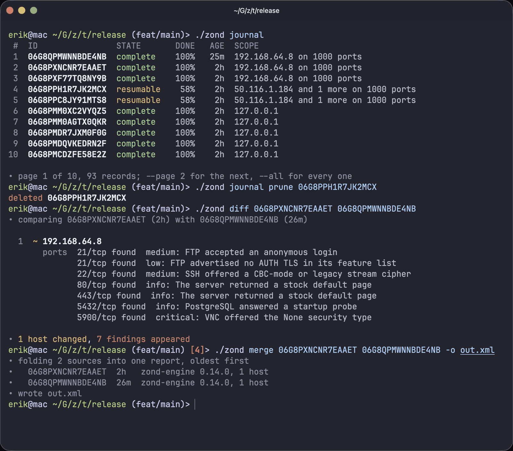

<h1 align="center">Zond</h1>

<p align="center">
  <a href="https://crates.io/crates/zond-cli"></a>
  <a href="https://www.gnu.org/licenses/agpl-3.0"></a>
  
</p>

<p align="center">
  Zond maps a network and says what is wrong with what it finds: which hosts are
  alive, which of their ports are open, what is listening behind each one, and which
  advisories name the versions it read off the wire.<br>
  It runs on Linux, macOS and Windows, and the scanning lives in
  <a href="https://github.com/zond-rs/zond-engine">Zond Engine</a>, a library anybody can build on.
</p>

<p align="center">
  
  
  
  
</p>

## Installing

On Debian, Ubuntu and Kali, from the [latest release](https://github.com/zond-rs/zond/releases/latest).
Packages are built for `amd64` and `arm64`.

```bash
sudo apt install ./zond_*.deb
```

Installing grants the binary `cap_net_raw`, so a scan runs without `sudo` and
the journals it writes belong to the user who ran it.

With a Rust toolchain, from crates.io.

```bash
cargo install zond-cli
```

The crate is `zond-cli` and the command it installs is `zond`.

On Windows, `zond-<version>-setup.exe` from the latest release. It needs
[Npcap](https://npcap.com), and installs for the current user without
administrator rights.

## The commands

| | |
|---|---|
| `zond discover` | which hosts on a network are alive. `d` for short |
| `zond scan` | which of a host's ports are open, and what is behind them. `s` |
| `zond listen` | watch a link and record what it carries. Sends nothing. `l` |
| `zond journal` | the scans this machine has a record of, and continuing one that stopped |
| `zond read` | print a scan that is already written down |
| `zond diff` | what changed between two scans |
| `zond merge` | several scans folded into one report |
| `zond detections` | what a scan would check for, and compiling your own |

```bash
sudo zond discover lan                              # sweep this host's own segment
sudo zond scan 10.0.0.0/24 -d                       # ports, services, and findings
sudo zond scan 10.0.0.1 -p- -O --tls-enum           # every port, the OS, and what TLS accepts
sudo zond scan lan --top-ports 100 --pipe           # a quick pass, one record per line
sudo zond scan 10.0.0.0/16 --exclude 10.0.5.0/24
sudo zond listen %en0 --for 10m                     # watch a link, send nothing

zond scan --resume 06G3JC                           # continue one that stopped
zond journal prune --older-than 30d
zond read latest -o report.html
zond diff baseline.json latest                      # exits 4 if anything changed
zond merge chunk*.json -o all.xml
zond detections --service http --sort class         # what a web port would be asked
```

## Naming a target

```bash
sudo zond discover 192.168.0.0/24
```

| Written | Means |
|---|---|
| `192.0.2.1` | one address |
| `192.0.2.1-50` | a range; the end continues the start's octets |
| `192.168.0.0/24` | a CIDR block |
| `2001:db8::1`, `2001:db8::/120` | an IPv6 address or prefix |
| `fe80::1%en0` | a link-local address, on a named interface |
| `one.one.one.one` | a hostname, resolved before the scan |
| `lan` | this host's own segment |

Several at once, comma-separated, and a target may carry its own ports as in
`10.0.0.1:8080`. `--exclude` takes the same grammar for addresses the run may
not touch, enforced before the first packet and again at every finding.
`--exclude-ports` takes the port grammar for ports no probe may reach, the
liveness check and OS detection included.

`lan` names a network rather than the range it covers, so it also sends the
ICMPv6 all-nodes echo and reads this host's neighbour table.

A scan checks each target is alive before probing its ports. `--assume-up`
skips that.

### Why `sudo`

ARP, ICMPv6 and raw TCP need root. Without it a scan falls back to connect
attempts and finds fewer hosts, and says which of the two ran.

## What else it does

**Keeps a record, without being asked.** `zond journal` lists them,
`zond scan --resume 06G3JC` continues one from a prefix of its id.

**Compares two scans, whoever ran them.** `zond diff baseline.json latest`
takes a file or a record id on either side, and nmap XML as readily as its own
JSON. Exits `4` on a change, so a nightly job is `zond diff last tonight || notify`.

**Folds several scans into one.** `zond merge chunk*.json`. A later source wins
only where it made a claim, so a host missing from tonight's scan is not a host
that went away.

**Shows its working.** `--reason` puts the packet behind every port state,
`--evidence` the excerpt behind every finding.

**Answers a program as readily as a person.** `--pipe` writes fourteen
tab-separated fields per host. `-o out.json` takes the format from the
extension: JSON, JSONL, CSV, a self-contained HTML page, nmap XML. Records go to
stdout and everything else to stderr.

**Runs detections you wrote, and detections you were sent.** A detection is a
TOML document; `--detections ./checks` runs a directory of them. Somebody else's
arrive as a signed bundle and load only against a key you name.

## Settings

`~/.config/zond/cli.toml` is how a run is shown, `~/.config/zond/engine.toml` is
what it puts on the wire. Both are written on first run with every key commented
out.

They layer: built-in defaults, `/etc/zond/*.toml`, those two, then the flags. A
layer speaks only about the keys it mentions, so a flag you did not pass cannot
cancel a setting you did write. `exclude` and `exclude_ports` accumulate
rather than being overridden.

`--presentation` picks how a run is drawn: `fancy` blocks, `minimal` listing, or
`pipe` records.

## Exit status

| | |
|---|---|
| 0 | Finished, and covered everything it was asked to. |
| 1 | Could not be carried out. |
| 2 | What was asked for was not usable. |
| 3 | Finished, but something it was asked to cover was not covered. |
| 4 | A comparison found changes. `zond diff` only. |
| 130 | Interrupted with Ctrl-C. |

Finding nothing is not a failure. `3` is the one worth knowing about: the run
came back narrower than what was asked for.

## Building on it

The scanning, the domain model, the report and the file formats live in
[zond-engine](https://github.com/zond-rs/zond-engine), a library anybody can
use. This repository holds the argument grammar, target resolution, rendering
and the exit status.

## License

AGPL-3.0-or-later. See [LICENSE](LICENSE).

If you distribute this, or run a modified version as a network service, your
users are entitled to the corresponding source. A commercial license is
available for deployments the AGPL does not suit: **licensing@zond.rs**.

Copyright (c) 2026 Erik Lening (hollowpointer) and Contributors.
